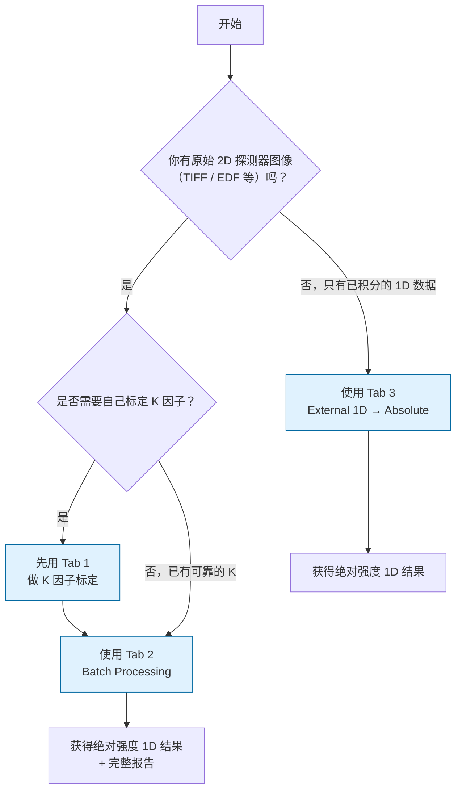

# saxsabs

[](https://github.com/D-sudoasd/SASAbs_saxs-absolute-calibration/actions/workflows/ci.yml)
[](https://doi.org/10.5281/zenodo.19687104)
[](LICENSE)
[](https://www.python.org/)

SAXS absolute intensity calibration and robust external 1D profile parsing utilities.

Standalone desktop app name: **SAXSAbs Workbench**.

Archived release DOI: https://doi.org/10.5281/zenodo.19687104

## Overview

`saxsabs` is an open-source Python package for reproducible small-angle X-ray
scattering (SAXS) absolute-intensity calibration workflows. It provides:

- **Multi-standard calibration** — pluggable registry with NIST SRM 3600 glassy
  carbon, liquid water (temperature-dependent dΣ/dΩ), and user-supplied
  reference data
- **Robust K-factor estimation** against any registered standard using
  median / MAD outlier filtering
- **Traceable μ models** — a bundled, fingerprinted NIST 30 keV composition
  snapshot for the locked BL19B2 alloy workflow, plus an explicitly diagnostic
  arbitrary-energy calculator using the Elam database through xraydb
- **Buffer / solvent subtraction** — α-scaling with full error propagation for
  BioSAXS workflows
- **Preflight gate** — automated pre-batch risk scoring (READY / CAUTION / BLOCKED)
  to catch missing headers, invalid transmission, or unreliable thickness before
  processing starts
- **Execution policy** — resume / overwrite / skip semantics for batch processing
  to safely restart interrupted jobs
- **Multi-format output** — TSV, CSV, canSAS 1D XML, NXcanSAS HDF5
- **Monitor-mode-aware normalization** (`rate` vs. `integrated`) with explicit
  formulae
- **Robust header parsing** for heterogeneous instrument metadata
- **Format-agnostic 1D profile ingestion** (CSV, space-delimited,
  semicolon-delimited)
- **Headless CLI** for batch processing and CI-driven validation
- **Bilingual GUI** (中文 / English) with Sun Valley (Win 11) theme and
  light / dark mode toggle

## Version 2.0 safety boundaries

- Formal Tab 2/Tab 3 output requires a source-verified calibration record; legacy v1, incomplete v2, manually entered K, and operator-incompatible external 1D profiles are inspection-only.
- Q, 2theta, and chi axes are unit-checked. Named-axis conflicts and cross-axis subtraction fail closed; `q_nm^-1` is converted explicitly to `A^-1`.
- BL19B2 reports a partial uncertainty budget while shared calibration-background raw-count and dark covariance remain unquantified. It never substitutes the NIST certificate coverage factor for a system coverage factor.
- The reusable `saxsabs.io.calibrated2d` multi-file package writer uses transactional
  publication and content-bound resume validation. This is not whole-campaign atomic
  publication: the strict BL19B2 campaign can still leave an explicitly incomplete run.
- Workbench Tab 2 permits fixed thickness only for formal output. The per-frame
  Beer-Lambert control and both Tab 2/Tab 3 existence-only resume controls are
  UI-disabled; forced values are BLOCKED by Dry Check and rejected again at Run.
  Each frame's transmission is still used for normalization.
- Tab 2 and Tab 3 K fields, and the Tab 2 μ field, are read-only. K comes from
  the active verified calibration record; μ comes from the provenance-aware
  calculator. Run requires a matching Dry Check approval. Tracked parameter,
  source-path, or BG/Dark library mutations invalidate that approval.
- Tab 3 raw-1D correction is disabled. Formal K and K/d accept only an explicit
  machine-readable `relative` state; `raw_counts`, `absolute_cm^-1`, and
  `ambiguous` fail closed. K/d requires positive thickness, while K-only requires
  inherited `thickness` in `corrections_applied`. `do_not_repeat` prevents duplicate
  execution but is never accepted as proof that a required physical correction ran.
- Optional buffer subtraction accepts only explicit `absolute_cm^-1`, `1/cm`
  input whose `corrections_applied` contains K+thickness, with an explicit complete
  `CalibrationContext` fingerprint and numeric `k_factor` matching the active K.
  Operator-payload fallback and `do_not_repeat` alone are insufficient. Dry Check
  verifies q coverage before Run; the report records `BufferKFactor`. Optional
  `u(alpha)` is finite and non-negative when supplied; blank maps to `None` and
  keeps combined uncertainty NaN. Text profiles keep the statistical component
  separate from the combined-standard result; `Error_cm^-1` aliases the best
  available combined result. Each buffered profile also records the buffer's safe
  filename and SHA-256, alpha, `u(alpha)`, propagation model, and uncertainty type
  in its own header/provenance. If the shared core buffer kernel is unavailable,
  formal subtraction fails closed without a weaker Workbench fallback.

These protections do not yet make the desktop Workbench an exact front end to
the strict BL19B2 campaign runner. Formal multi-folder/per-sample fixed-thickness
campaign ownership remains in the strict CLI/batch path; the scientific kernels
are not yet unified. Workbench also lacks atomic campaign publication and
content-signature resume. K-only verifies that thickness is in the inherited
ledger but does not yet require its numeric value/source. See
`docs/scientific_safety_ui_upgrade_audit_20260713.md` for the current boundary.
The current worktree also has an open P1 repository-hygiene boundary: roughly
79 MiB under `audit_outputs/` and campaign-specific tests are coupled to private
`H:\...` paths. Those artifacts must be separated, minimized/anonymized, or gated
as opt-in local acceptance fixtures before a distributable release.

## GUI Workflow Overview

The **SAXSAbs Workbench** has four main tabs with a clear division of labor:

| Tab | Name                        | Input Type          | What it does |
|-----|-----------------------------|---------------------|--------------|
| 1   | K-Factor Calibration        | **2D images**       | Calibrate K-factor using standard sample (GC or Water) from raw 2D detector images |
| 2   | Batch Processing            | **2D images**       | Process large numbers of 2D TIFF/EDF images into absolute intensity 1D profiles |
| 3   | External 1D → Absolute      | **Already integrated 1D** | Apply absolute scaling to 1D profiles exported from pyFAI or other software |
| 4   | Help                        | —                   | Detailed usage guide |

**Important distinction** (请务必注意):

- **Tab 1 和 Tab 2** 是**完整的 2D 图像处理流程**：
  - 输入：原始 2D 探测器图像（TIFF、EDF、CBF 等）
  - 内部完成：2D 扣背景 + 方位角积分（使用 pyFAI） + 绝对强度换算
  - 适合：大多数束线用户日常使用

- **Tab 3** 仅用于**后处理 1D 数据**：
  - 输入：已经用 pyFAI 或其他软件积分好的 1D 曲线
  - 只做：绝对强度标定（K 因子应用）
  - 适合：与合作者交换 1D 数据时使用，或你自己已经提前积分好的情况
  - 正式输出前提：输入必须声明 relative intensity state、兼容的
    `CalibrationContext` 和校正账本；K-only 还必须声明 thickness 已完成

**强烈建议**：除非你明确知道自己只有 1D 数据，否则请优先使用 **Tab 1 + Tab 2** 这一整套 2D 处理流程。

**Recommended workflow**:
1. Use **Tab 1** to obtain a reliable K-factor.
2. Use **Tab 2** for routine high-throughput processing of 2D data.
3. Use **Tab 3** when collaborating with people who only provide integrated 1D curves.

### 快速选择路径（新用户必看）

请根据下图快速判断自己应该使用哪些 Tab：



**简单规则**：
- **有 2D 原始图像** → 主要使用 **Tab 1 + Tab 2**
- **只有外部软件积分好的 1D 数据** → 满足上述 provenance/ledger 契约时使用 **Tab 3**；否则只检查，不生成正式绝对强度

## Highlights of recent improvements

### Scientific accuracy

- **Transmission validation** — T > 1 is now rejected with an explicit warning
  (physically impossible for standard absorption)
- **Dark-current error propagation** — corrected the partial derivative sign in
  the `(S−D)/Ns − (BG−D)/Nb` formula to use `(1/Nb − 1/Ns)` instead of
  `(1/Ns + 1/Nb)`
- **Water standard K uncertainty** — replaced hardcoded `k_std = 0` with the
  same MAD-based robust dispersion used for the glassy carbon path
- **canSAS / NXcanSAS export guard** — blocks export when the x-axis is not
  momentum-transfer Q (e.g. chi-angle data), preventing silent unit mismatch
- **Buffer subtraction uncertainty** — the shared core path propagates buffer
  and scale-factor uncertainty:
  σ² = σ\_s² + α² σ\_b² + I\_b² σ\_α². A missing σ\_α remains unknown and
  therefore keeps the combined uncertainty as NaN; pass `0.0` only when α is
  known to be exact. Text output writes the first two terms to
  `Error_Statistical_cm^-1`, all three terms to
  `Error_CombinedStandard_cm^-1`, and uses the combined value for the legacy
  `Error_cm^-1` alias whenever buffer subtraction is active.
- **Duplicate x-point error merging** — fixed from arithmetic averaging
  (Σσᵢ / N) to proper quadrature (√Σσᵢ² / N)

### GUI polish

- Tab labels carry icon prefixes (📐 📦 📈 ❓) for quick visual navigation
- Primary action buttons simplified from `>>> Run ... <<<` to clean
  `▶  Run ...` labels styled via the Accent theme
- **Semantic status bar** — error → red, success → green, warning → amber,
  with automatic keyword detection
- **Report text highlighting** — error / success / warning lines are
  colour-coded in the analysis report pane
- Font consistency fix (replaced stray Arial with the global Segoe UI style)
- Dark-mode foreground fix for the BG path label
- Initial window geometry is screen-aware and uses a smaller `900 × 600`
  minimum so the scrollable pages remain reachable on compact displays.

### Workbench scientific-safety upgrade (2026-07-13)

- Fixed thickness is the only formal Tab 2 path. Legacy per-frame derivation
  and both existence-only resume controls are disabled in the UI, BLOCKED in
  Dry Check, and rejected again at Run.
- Dry Check approval is bound to a canonical configuration fingerprint and is
  revalidated at both Tab 2 and Tab 3 Run entry points. Current Workbench file
  identities bind resolved path, size, and modification time; campaign-level
  content-hash ownership remains future work. BG/Dark library additions,
  recursive additions, and clears immediately invalidate Tab 2 approval.
- The NIST 30 keV material core records wt% composition, element mu/rho values,
  ideal-mixture density, linear mu, source snapshot, partial uncertainty status,
  porosity warning, and a provenance SHA-256. The screen-aware, scrollable GUI
  infers nominal identity from the edited composition, binds PONI identity and
  checks available PONI energy against 30 keV, invalidates stale results/export,
  and exports JSON without rounding internal μ. Elam provenance records the
  xraydb version and disables the NIST-only porosity option.
  Export re-resolves and re-hashes the current PONI path, content, and energy;
  any change requires recalculation. Formal fixed-thickness Tab 2
  metadata/preflight excludes diagnostic attenuation and records
  `mu_used_in_thickness_model=false`.
- Project-owned absolute 1D exports carry `intensity_state`, `intensity_unit`,
  `corrections_applied`, and `do_not_repeat`; formal K/Kd accepts only explicitly
  reduced `relative` input, so `raw_counts`, absolute, and ambiguous profiles are
  blocked. Tab 3 merges the input ledger
  with the actual K, optional thickness, and optional buffer operations; Tab 2
  derives its default ledger from the active detector-reduction context.
  `do_not_repeat` is unioned only for duplicate-operation protection; required
  existing corrections and absolute-buffer physical state must be proved by
  `corrections_applied`. A conflict between the two ledgers makes the state
  ambiguous and fails closed.
- Validated buffer state, unit, ledger, context fingerprint, alpha, and file
  identity enter the frame report and run metadata, including `BufferKFactor`
  and `BufferAlphaUncertainty`.
  The buffer requires an explicit full context fingerprint and matching numeric
  K; operator payload fallback is rejected. Optional `u(alpha)` is accepted by
  the Workbench and passed to the only core kernel; blank remains unknown/NaN
  rather than being silently set to zero. Buffered text profiles preserve separate
  statistical and combined-standard columns, while every supported output format
  carries the buffer's safe filename and SHA-256, alpha, `u(alpha)`, the
  propagation formula, and uncertainty type in portable operator provenance.
- FabIO handle closure is complete in the strict 1D reader and the strict 2D
  resume verification path, but not yet across the shared loader and all
  Workbench/strict-2D read paths.

## Installation

Core library (CLI + API):

```bash
pip install -e .
```

With GUI dependencies:

```bash
pip install -e .[gui]
```

With all optional I/O formats:

```bash
pip install -e .[gui,hdf5]
```

Developer tools:

```bash
pip install -e .[dev]
```

## Quick Start with the GUI (Recommended for most users)

1. Double-click `Start_SAXSAbs_Workbench.bat` (Windows) or run:
   ```bash
   python saxsabs_workbench.py
   ```
2. **First time**: Go to **Tab 1** to calibrate a K-factor using your standard sample.
3. Then go to **Tab 2**, keep fixed thickness for thickness-invariant samples,
   complete **Dry Check**, and process the real 2D datasets in batch.
4. If you only have already-integrated 1D data, use **Tab 3**.

See the new "GUI Workflow Overview" table above for which tab to use.

## Launch as standalone desktop program (Windows)

Double-click one of the following files in repository root:

- `Start_SAXSAbs_Workbench.bat`
- `saxsabs_workbench.pyw`

Or run:

```bash
python saxsabs_workbench.py
```

Language selection:

```bash
python saxsabs_workbench.py --lang en
python saxsabs_workbench.py --lang zh
```

Installed launcher command:

```bash
saxsabs-workbench --version
saxsabs-workbench --lang zh
```

Note: `saxsabs-workbench` expects `SASAbs.py` to be available in the current
repository workspace.

## Quick CLI examples

The CLI exposes six subcommands: four focused utilities (`norm-factor`,
`parse-header`, `parse-external1d`, and `estimate-k`), the safety-first
`bl19b2-abs2d` workflow, and the explicit `bl19b2-abs2d-v1-legacy` migration
entry.

Compute normalization factor:

```bash
saxsabs norm-factor --mode rate --exp 1.0 --mon 100000 --trans 0.8
```

Parse header values from JSON:

```bash
saxsabs parse-header --header-json examples/header_example.json
```

Parse external 1D profile:

```bash
saxsabs parse-external1d --input examples/profile_example.csv
```

Estimate robust K-factor from measured/reference curves:

```bash
saxsabs estimate-k --meas examples/k_measured.csv --ref examples/k_reference.csv --qmin 0.01 --qmax 0.2
```

Run the safety-first BL19B2 absolute-2D workflow with explicit scientific
semantics:

```bash
saxsabs bl19b2-abs2d --input-root DATA --poni geometry.poni --monitor-mode rate --mu 20.2 --standard-key SRM3600 --correct-solid-angle-for-k --no-polarization-correction
```

Historical v1 commands must use the dedicated `bl19b2-abs2d-v1-legacy`
migration entry. It requires explicit monitor and thickness choices (or explicit
acknowledgement of the former rate-monitor and `mu=20.2 cm^-1` assumptions); old
unsafe defaults are never restored silently. See
`docs/bl19b2_abs2d_batch_runbook.md` for the migration command.

## Public API

### Calibration & normalization

- `saxsabs.compute_norm_factor` — monitor normalization factor
- `saxsabs.estimate_k_factor_robust` — robust K-factor with MAD filtering
- `saxsabs.STANDARD_REGISTRY` — pluggable standard-reference registry
- `saxsabs.get_reference_data` — retrieve reference data by name
- `saxsabs.water_dsdw` — temperature-dependent water dΣ/dΩ

### μ calculator

- `saxsabs.calculate_material_attenuation` — traceable composition-model μ from
  the bundled NIST 30 keV table snapshot
- `saxsabs.calculate_nominal_material_attenuation` — locked Ti-24Nb-4Zr-8Sn,
  Ti-6Al-4V, or Zr-2.5Nb nominal-composition calculation
- `saxsabs.identify_nominal_material` — attach a nominal identity only when the
  edited composition actually matches that material
- `saxsabs.derive_fixed_thickness` — robust-median transmission to fixed
  Beer-Lambert thickness with provenance
- `saxsabs.calculate_mu` — arbitrary-energy diagnostic composition model using
  xraydb's Elam data
- `saxsabs.mu_rho_single` — xraydb/Elam mass attenuation for one element
- `saxsabs.parse_composition_string` — parse `"Fe:0.9,Cr:0.1"` notation

### Buffer subtraction

- `saxsabs.subtract_buffer` — α-scaling subtraction with error propagation
- `saxsabs.require_absolute_input_for_buffer_subtraction` — fail-closed
  absolute-state/unit/K+thickness ledger validation before subtraction

### Batch workflow helpers

- `saxsabs.evaluate_preflight_gate` — pre-batch risk scoring (READY / CAUTION / BLOCKED)
- `saxsabs.PreflightGateSummary` — result container for preflight evaluation
- `saxsabs.parse_run_policy` — parse resume / overwrite execution policy
- `saxsabs.should_skip_all_existing` — check if all outputs already exist

### I/O

- `saxsabs.parse_header_values` — heterogeneous header parsing
- `saxsabs.read_external_1d_profile` — format-agnostic 1D ingestion
- `saxsabs.write_cansas1d_xml` — canSAS 1D XML export
- `saxsabs.write_nxcansas_h5` — NXcanSAS HDF5 export

## Verification

```bash
pytest -q
```

Automated tests run across 3 OS × 4 Python versions (3.10–3.13), including
optional pyFAI/fabio/HDF5 workflow dependencies.

Manual workflow verification checklist is in `examples/manual-verification.md`.

Minimal anonymized 2D end-to-end reproducibility package:

- `examples/minimal_2d/README.md`
- `python examples/minimal_2d/run_minimal_2d_pipeline.py`

## Documentation

- `docs/architecture.md` — software architecture and design decisions
- `docs/reviewer-faq.md` — FAQ for JOSS reviewers
- `docs/joss-submission-checklist.md` — submission readiness checklist
- `docs/impact-evidence-template.md` — research impact evidence
- `CONTRIBUTING.md` — contribution guidelines
- `CODE_OF_CONDUCT.md` — Contributor Covenant v2.1
- `CITATION.cff` — citation metadata
- `CHANGELOG.md` — version history

## Citation

If you cite the archived software release, use the Zenodo DOI:

- https://doi.org/10.5281/zenodo.19687104

## JOSS paper

Paper draft files:

- `paper/paper.md`
- `paper/paper.bib`
