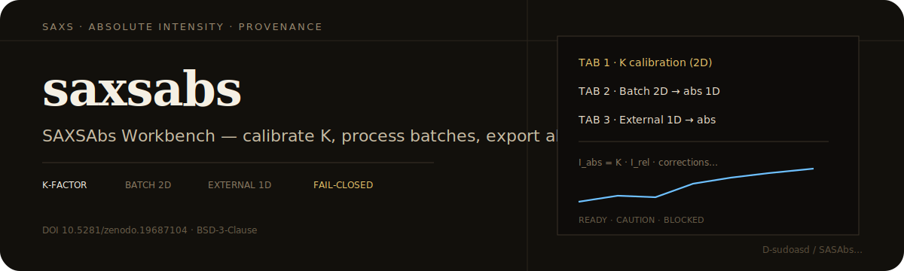
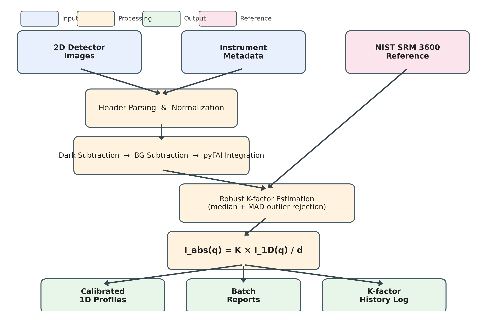
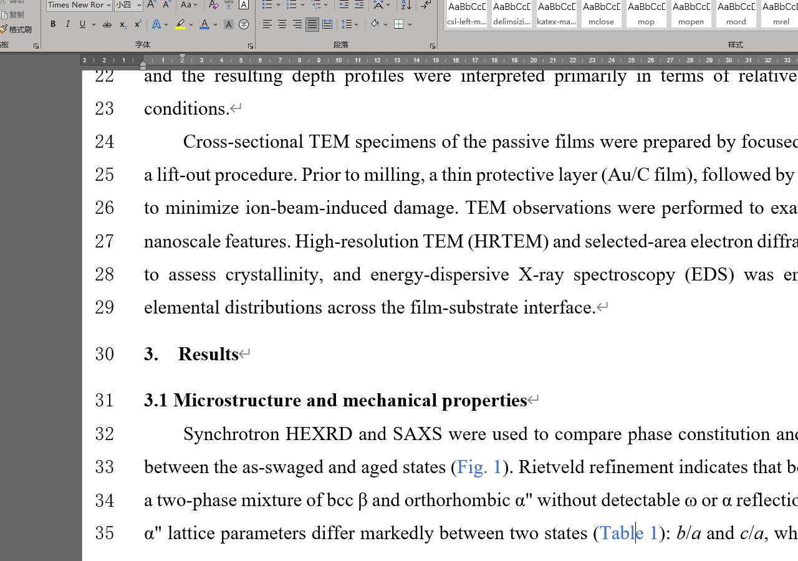
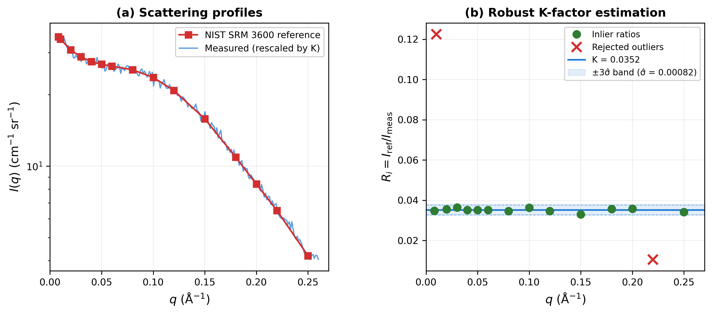

<p align="center">
  
</p>

# saxsabs

[](https://github.com/D-sudoasd/SASAbs_saxs-absolute-calibration/actions/workflows/ci.yml)
[](https://doi.org/10.5281/zenodo.19687104)
[](LICENSE)

**SAXS absolute intensity calibration** · desktop app **SAXSAbs Workbench** · DOI https://doi.org/10.5281/zenodo.19687104

<p align="center">
  
</p>

<p align="center">
  
  &nbsp;
  
</p>

<p align="center">
  
</p>

| Tab | Input | Role |
|-----|-------|------|
| 1 K-Factor | **2D** | Calibrate K (GC / water) |
| 2 Batch | **2D** | 2D → absolute 1D (pyFAI integrate + absolute scale) |
| 3 External 1D | **1D** | Absolute scaling only when contracts met |
| 4 Help | — | Guide |

**Rule:** raw 2D → Tab 1+2 · only integrated 1D → Tab 3 when provenance OK.

Also: multi-standard registry · robust K (median/MAD) · traceable μ · buffer subtraction · preflight READY/CAUTION/BLOCKED · canSAS / NXcanSAS · bilingual GUI.

<p align="center">
  
</p>

Formal output is **fail-closed**: verified calibration records, unit-checked axes, fixed-thickness Tab 2 path, read-only K/μ from records, Dry Check fingerprints. Workbench is not yet a full substitute for the strict BL19B2 campaign runner — see `docs/`.

```bash
pytest -q
# examples/minimal_2d/ · examples/manual-verification.md
```

Cite: https://doi.org/10.5281/zenodo.19687104 · BSD-3-Clause
