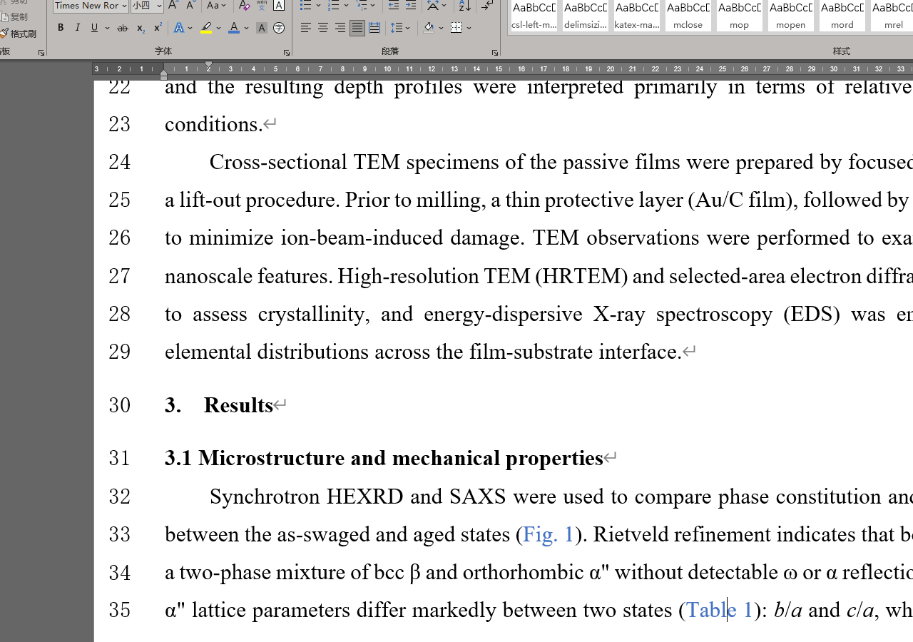

# Summary

`saxsabs` is an open-source Python package that provides a complete, reproducible
workflow for small-angle X-ray scattering (SAXS) absolute intensity calibration.
It automates the data-reduction chain from raw two-dimensional (2D) detector images
to calibrated one-dimensional (1D) scattering profiles on an absolute differential
cross-section scale (cm$^{-1}$ sr$^{-1}$). The software comprises a modular core
library, a command-line interface (CLI), and a graphical user interface (GUI) with
bilingual support (Chinese/English).

Key capabilities include:

- **Multi-standard calibration** using a pluggable registry that ships with NIST
  Standard Reference Material 3600 (SRM 3600) glassy carbon [@srm3600] and
  liquid water [@orthaber2000], with support for user-supplied reference data.
- **Robust K-factor estimation** via median absolute deviation (MAD) outlier
  rejection.
- **Universal linear attenuation coefficient ($\mu$) calculator** driven by the
  XCOM photon cross-section database through xraydb [@newville_xraydb], accepting
  arbitrary chemical compositions and photon energies.
- **Buffer / solvent subtraction** with tuneable scaling factor $\alpha$ and
  full error propagation, addressing protein solution SAXS (BioSAXS) workflows.
- **Multi-format output** in TSV, CSV, canSAS 1D XML, and NXcanSAS HDF5,
  promoting interoperability with the NeXus/canSAS data-exchange ecosystem.
- **Monitor-mode-aware normalization**, format-agnostic 1D profile parsing, and
  heterogeneous header extraction.

Building on pyFAI [@pyfai] and fabio for integration and image I/O, `saxsabs`
adds the calibration-control and metadata-plumbing layers typically handled by
ad hoc local scripts at synchrotron beamlines.

# Statement of need

Converting SAXS detector images to absolute-scale intensities requires
dark-current subtraction, beam-monitor normalization, transmission and thickness
correction, azimuthal integration, and calibration against a reference standard.
In practice, each step is complicated by real-world heterogeneity: header formats
differ across beamlines, 1D profiles use inconsistent delimiters and column names,
and the choice of calibration standard varies by experimental context—glassy
carbon for solid-state SAXS, liquid water for BioSAXS, or a user-measured
secondary standard for instrument-specific setups.

Existing tools address individual stages well—pyFAI [@pyfai], SasView [@sasview],
Dioptas [@dioptas], BioXTAS RAW [@bioxtasraw], and Irena [@irena]—but none
provides a dedicated end-to-end absolute-calibration workflow that jointly handles
metadata heterogeneity, multi-standard calibration, robust K-factor estimation,
buffer subtraction with error propagation, and batch processing with audit
trails. Moreover, the growing adoption of standardized data formats such as
canSAS XML and NXcanSAS HDF5 for SAXS data exchange demands that calibration
tools produce interoperable outputs natively. `saxsabs` fills this gap.

# State of the field

While the theory of calibration against NIST SRM 3600 glassy carbon is well
documented [@glatter_kratky; @srm3600], and liquid water is increasingly used as
a secondary standard for BioSAXS [@orthaber2000], the operational workflow—parsing
heterogeneous metadata, selecting normalization modes, multi-background
subtraction, computing a robust scaling factor, and converting the result to an
interoperable standard format—is typically left to bespoke, untested scripts.

: Functional comparison of SAXS software tools. `saxsabs` focuses on the calibration-control, standards management, and data-interoperability layer that bridges integration engines and absolute-scale reduction. []{label="tab:comparison"}

| Capability                         | pyFAI | SasView | Dioptas | BioXTAS RAW | Irena | saxsabs |
|------------------------------------|:-----:|:-------:|:-------:|:-----------:|:-----:|:-------:|
| Azimuthal integration              | ✓     |         | ✓       | ✓           | ✓     |         |
| SAS model fitting                  |       | ✓       |         | ✓           | ✓     |         |
| Multi-standard calibration         |       |         |         |             |       | ✓       |
| Water-standard $d\Sigma/d\Omega$   |       |         |         | ✓           |       | ✓       |
| $\mu$ calculator (XCOM)            |       |         |         |             |       | ✓       |
| Buffer / solvent subtraction       |       |         |         | ✓           |       | ✓       |
| Heterogeneous header parsing       |       |         |         |             |       | ✓       |
| Monitor-mode normalization         |       |         |         |             |       | ✓       |
| Robust K-factor (MAD filtering)    |       |         |         |             |       | ✓       |
| Format-agnostic 1D ingestion       |       |         |         | partial     |       | ✓       |
| Multi-background averaging         |       |         |         |             |       | ✓       |
| canSAS / NXcanSAS export           |       | ✓       |         |             |       | ✓       |
| Headless CLI + CI-testable         | ✓     | partial |         |             |       | ✓       |

`saxsabs` complements these tools by formalizing the calibration-control layer
that typically exists as private, untested scripts, making absolute-scaling
workflows reproducible and auditable.

# Software design

The primary design goal is to separate numerical calibration logic from UI
concerns, enabling both interactive GUI use and headless CLI execution. The
software is organized into four layers:

- **Core numerical layer** (`saxsabs.core`): implements monitor normalization,
  robust K-factor estimation, a pluggable standard-reference registry
  (`calibration.py`—SRM 3600, water, custom data), a universal linear
  attenuation coefficient calculator (`mu_calculator.py`—driven by xraydb
  [@newville_xraydb]), and buffer/solvent subtraction with full error
  propagation (`buffer_subtraction.py`).
- **I/O layer** (`saxsabs.io`): provides format-agnostic header parsing (fuzzy
  key matching with unit conversion), multi-strategy 1D profile parsing (three
  separator strategies with automatic column-role inference), and multi-format
  writers for canSAS 1D XML and NXcanSAS HDF5 (`writers.py`).
- **CLI layer** (`saxsabs.cli`): exposes four subcommands (`norm-factor`,
  `parse-header`, `parse-external1d`, `estimate-k`) for reproducible, scriptable
  execution.
- **GUI layer** (`SASAbs.py`): a tkinter-based application themed with Sun
  Valley (sv\_ttk) providing a modern Windows 11 appearance with light/dark mode
  toggle.  Four tabbed panels—K-Factor Calibration, Batch Processing, External
  1D Conversion, and Help—offer bilingual (Chinese/English) support.

{#fig:workflow width="95%"}

This architecture enables unit testing of core functions independently of the GUI (50 automated tests across 3 OS × 4 Python versions), while preserving the GUI for interactive beamline use (\autoref{fig:gui}). The incremental migration from monolithic script to modular library avoids abrupt workflow disruption.

{#fig:gui width="95%"}

## Mathematical formulation

The absolute intensity calibration workflow follows the standard procedure documented for NIST SRM 3600 [@srm3600; @glatter_kratky]. The key computational steps are:

**Monitor normalization.** Two modes are supported. In *rate* mode, the normalization factor is:

$$N = t_{\mathrm{exp}} \times I_0 \times T \label{eq:norm_rate}$$

where $t_{\mathrm{exp}}$ is the exposure time (s), $I_0$ is the beam-monitor count, and $T$ is the sample transmission. In *integrated* mode, $t_{\mathrm{exp}}$ is omitted:

$$N = I_0 \times T \label{eq:norm_int}$$

**2D background subtraction.** Given sample image $D_s$, dark image $D_d$, and background images $\{D_{\mathrm{bg},i}\}$:

$$I_{\mathrm{net}}(x,y) = \frac{D_s - D_d}{N_s} - \left\langle \frac{D_{\mathrm{bg},i} - D_d}{N_{\mathrm{bg},i}} \right\rangle \label{eq:bg_sub}$$

where $\langle\cdot\rangle$ denotes pixel-wise averaging over all background images.

**Robust K-factor estimation.** After azimuthal integration via pyFAI to obtain $I_{\mathrm{meas}}(q)$, the profile is interpolated onto the NIST SRM 3600 reference grid (15 points, $q \in [0.008, 0.250]$ Å$^{-1}$). Point-wise ratios are computed:

$$R_i = I_{\mathrm{ref}}(q_i) \,/\, I_{\mathrm{meas}}(q_i) \label{eq:ratio}$$

Outlier rejection uses the median absolute deviation (MAD):

$$\hat{\sigma} = 1.4826 \times \mathrm{median}(|R_i - \tilde{R}|) \label{eq:mad}$$

where $\tilde{R} = \mathrm{median}(R_i)$. Points with $|R_i - \tilde{R}| > 3\hat{\sigma}$ are rejected, and:

$$K = \mathrm{median}(R_i) \quad \text{for } |R_i - \tilde{R}| \leq 3\hat{\sigma} \label{eq:kfactor}$$

The factor 1.4826 ensures consistency with the standard deviation under a Gaussian distribution. This robust estimator resists outliers from parasitic scattering, beamstop shadows, or detector artefacts (\autoref{fig:kfactor}).

{#fig:kfactor width="95%"}

**Absolute intensity conversion.** For each sample:

$$I_{\mathrm{abs}}(q) = K \times I_{\mathrm{1D}}(q) \,/\, d \label{eq:abs}$$

where $d$ is the sample thickness (cm). When transmission is available, $d$ can be estimated via the Beer–Lambert relation $d = -\ln(T)/\mu$, where $\mu$ is the linear attenuation coefficient. `saxsabs` includes a built-in $\mu$ calculator driven by the XCOM photon cross-section database through xraydb [@newville_xraydb]:

$$\mu = \rho \sum_i w_i \left(\frac{\mu}{\rho}\right)_i \label{eq:mu}$$

where $\rho$ is the bulk density, $w_i$ is the weight fraction of element $i$, and $(\mu/\rho)_i$ is its mass attenuation coefficient at the operating photon energy. The calculator accepts arbitrary chemical compositions (e.g., `"Fe:0.9,Cr:0.1"`) and preset alloy/compound libraries.

**Buffer / solvent subtraction.** For BioSAXS and solution-scattering experiments, the solute signal is obtained by subtracting a matched buffer measurement:

$$I_{\mathrm{solute}}(q) = I_{\mathrm{sample}}(q) - \alpha \, I_{\mathrm{buffer}}(q) \label{eq:buffer}$$

where $\alpha$ is a tuneable scaling factor (default 1.0). When both profiles carry error bars, the propagated uncertainty is $\sigma_{\mathrm{solute}} = \sqrt{\sigma_{\mathrm{sample}}^2 + \alpha^2 \sigma_{\mathrm{buffer}}^2}$.

## Batch processing and automation

The GUI batch-processing pipeline automates the complete chain from raw 2D images to calibrated 1D profiles:

- Automatic background and dark-current matching via a weighted scoring function comparing exposure, monitor counts, transmission, and temporal proximity.
- Multi-background averaging to reduce statistical noise in the background estimate.
- Three integration modes: full-ring, angular-sector (with ±180° wrapping), and radial chi-profile.
- Sector merging with inverse-variance weighting.
- Optional buffer / solvent subtraction with tuneable $\alpha$-scaling.
- Multi-format output: TSV (default), CSV, canSAS 1D XML, and NXcanSAS HDF5.
- Data quality controls and structured output traceability (CSV reports, JSON metadata, K-factor history log).

# Research impact statement

`saxsabs` has been deployed for routine absolute intensity calibration at the Institute of Metal Research, Chinese Academy of Sciences, processing data from multiple synchrotron beamlines. It has replaced manual spreadsheet-based procedures, reducing operator intervention and eliminating errors from inconsistent header parsing.

The software defines its impact along four dimensions:

- **Operational efficiency**: Calibration previously requiring manual metadata extraction and iterative K-factor fitting is now a single CLI invocation or GUI session, reducing processing time from minutes to seconds.
- **Reliability**: Defensive parsing and format-agnostic ingestion have eliminated silent data-misinterpretation failures when switching between instruments.
- **Traceability**: Every run produces structured, deterministic output suitable for version control and audit.
- **Interoperability**: Native canSAS XML and NXcanSAS HDF5 export enables seamless data exchange with downstream analysis tools (SasView, ATSAS, etc.) and institutional data repositories.

Core algorithms are verified by 50 automated tests across three operating systems and four Python versions (3.10–3.13) under continuous integration.

# AI usage disclosure

The following AI-assisted coding tools were used during the development of this software:

- GitHub Copilot (VS Code) and Anthropic Claude were used for code refactoring, internationalization extraction, test skeleton generation, and initial documentation drafts.
- AI assistance was limited to scaffolding and boilerplate. All core numerical algorithms were designed and validated by the author independently.
- Every AI-generated fragment was reviewed, tested, and revised before inclusion. Automated tests provide ongoing verification of scientific correctness.

# Acknowledgements

The author thanks beamline scientists and users at the Institute of Metal Research who provided practical feedback on data heterogeneity and workflow failure modes during the development and deployment of this software.

# References
